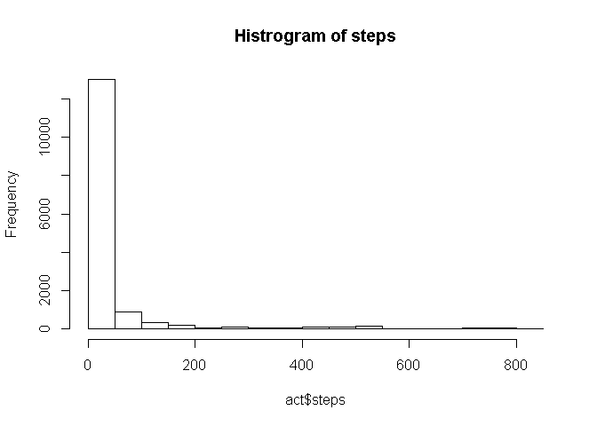
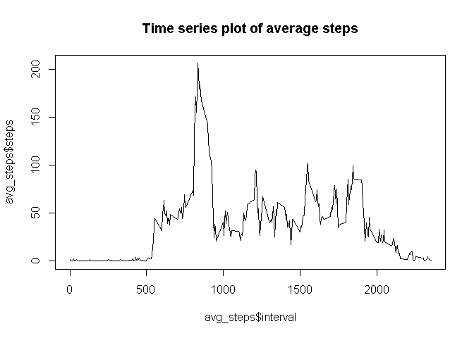
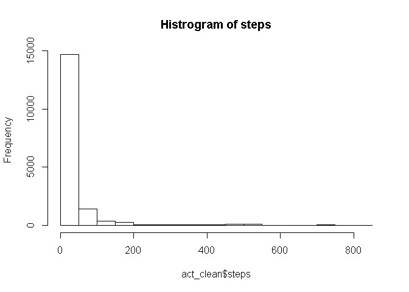
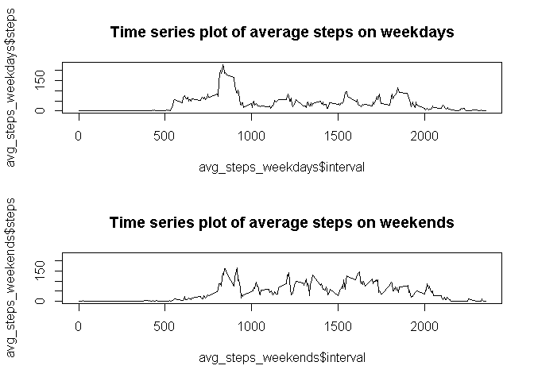

## Loading and preprocessing the data

```r
#Loading thr dataset
act <- read.csv("activity.csv")
```


## What is mean total number of steps taken per day?

```r
#plotting
hist(act$steps, main="Histrogram of steps")
```

<!-- -->

```r
mean(act$steps,na.rm = TRUE)
```

```
## [1] 37.3826
```

```r
median(act$steps,na.rm = TRUE)
```

```
## [1] 0
```


## What is the average daily activity pattern?


```r
act2 <- select(act,steps,interval)
#Grouping by intevals and taking the average step of each interval
avg_steps <- act2 %>%   group_by(interval) %>%
summarise_all(list(~ mean(., na.rm = TRUE)))
plot(avg_steps$interval,avg_steps$steps,type = 'l',main = "Time series plot of average steps")
```

<!-- -->

```r
max <- avg_steps[avg_steps$steps==max(avg_steps$steps),]$interval
```
The max step occurs at the 835 interval


## Imputing missing values

```r
colSums(is.na(act))
```

```
##    steps     date interval 
##     2304        0        0
```

```r
#imputing NA's by using the mean step of each interval
act_clean <- act %>% group_by(interval) %>%
mutate(steps=ifelse(is.na(steps),mean(steps,na.rm=TRUE),steps))

hist(act_clean$steps, main="Histrogram of steps")
```

<!-- -->

```r
mean(act_clean$steps,na.rm = TRUE)
```

```
## [1] 37.3826
```

```r
median(act_clean$steps,na.rm = TRUE)
```

```
## [1] 0
```
Since the mean is used to impute the NA's, there isnt any difference in the histogram and the mean value


## Are there differences in activity patterns between weekdays and weekends?


```r
act_clean$date <- as.Date(act_clean$date,'%Y-%m-%d')
act_clean$weekdays <- weekdays(act_clean$date)
#subsetting for weekdays
act_weekdays <- subset(act_clean, weekdays=='Monday'|weekdays=='Tuesday'|
                         weekdays=='Wednesday'|weekdays=='Thursday'|
                         weekdays=='Friday')
#subsetting for weekends
act_weekends <- subset(act_clean, weekdays=='Saturday'|weekdays=='Sunday')


act2_weekdays <- select(act_weekdays,steps,interval)
#Grouping by intevals and taking the average step of each interval
avg_steps_weekdays <- act2_weekdays %>%   group_by(interval) %>%
summarise_all(list(~ mean(., na.rm = TRUE)))


act2_weekends <- select(act_weekends,steps,interval)
#Grouping by intevals and taking the average step of each interval
avg_steps_weekends <- act2_weekends %>%   group_by(interval) %>%
summarise_all(list(~ mean(., na.rm = TRUE)))

par(mfrow=c(2,1))

plot(avg_steps_weekdays$interval,avg_steps_weekdays$steps,type = 'l',main = "Time series plot of average steps on weekdays")

plot(avg_steps_weekends$interval,avg_steps_weekends$steps,type = 'l',ylim = c(0,230),main = "Time series plot of average steps on weekends")
```

<!-- -->


